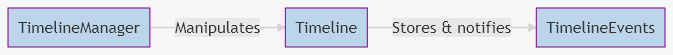

# Developers

Get the full documentation of the [API](Api.md).

## Dependencies

### for docs

-   [node](https://nodejs.org/en/download/) + npm (installed by default with node-js)
-   [Doxygen](http://www.doxygen.nl/download.html)

> [What I used for API documentation](https://sourcey.com/articles/generating-beautiful-cpp-markdown-documentation-with-moxygen)

## Design decisions

My goal was to create the most extensible plugin as possible and keep things simple and readable as inspired by [separation of concerns](https://en.wikipedia.org/wiki/Separation_of_concerns) philosophy.

### Core & UE4 separation

**> Core** module manage every "basic" functionnalities:

-   it manipulates basics data
-   it is a lightweight library with the less dependencies as possible (only **Core** UE4 modules)
-   it provides basics interfaces or abstract classes to work with
-   it can be build for simple project as **program** build instead of **game** build (to run fast unit tests for example, see [UE4-TPL-CppWithTestEnv](https://github.com/NansPellicari/UE4-TPL-CppWithTestEnv) for an "how to")

**> UE4** module is a more high level paradigm:

-   it is the bridge from **Core** library to **UE4 Editor** and **Game** program
-   it provides more complex implementation of **Core** interfaces or abstract classes thanks to a bunch of [decorators](https://refactoring.guru/design-patterns/decorator) to fit with general **game needs**.
-   it provides **configs** & **UI** (blueprints) for editor manipulations
-   it manages **serialization** for the whole system
-   it provides an abstract class for your **GameInstance** class to use as a **ParentClass**, this makes the glue with configurations, blueprint functions and serialization for savegame.

## How to override, create my own Event, Timeline, etc...

First, I create the whole structure to be the most extensible.  
To doing it, we have to consider **3** basics elements:

> To get more details, you can read the [README definitions](./README.md#3-definitions) section.

Each of these **Core** classes in `Source/NansTimelineSystemCore` have their **decorator(s)** in the `Source/NansTimelineSystemUE4`.  
The most preferable way to extend, it's to create you own decorator or override existants decorators.

### TimelineManager

It can be easily decorated, see [Source/NansTimelineSystemUE4/Public/Manager/\*](../Source/NansTimelineSystemUE4/Public/Manager/) for examples.  
You can create your own manager for your game specificities.

### Timeline

This class and it's decorator should not be overrided, they provide the basic functionnalities to manage events and serialization, they work more as extended queues rather than client object with complex usage.

### TimelineManagerEvent

You **should** create decorator for it, the best way its to extend the [Source/NansTimelineSystemUE4/Public/Event/TimelineEventDecorator.h](../Source/NansTimelineSystemUE4/Public/Event/TimelineEventDecorator.h) class.  
You can create a **blueprint** child based on it or a **c++** override.

## Contributing

You are very welcome if you want to contribute.  
I explain in [CONTRIBUTING.md](../CONTRIBUTING.md) what and how is the most comfortable way to me you can contribute.
