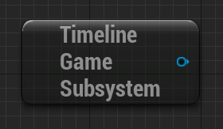
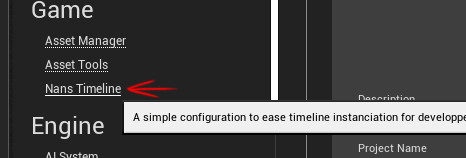
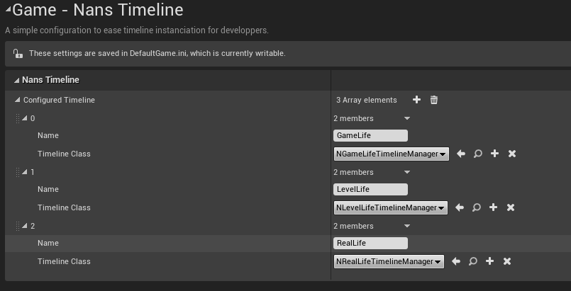
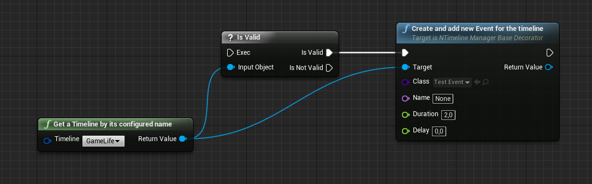
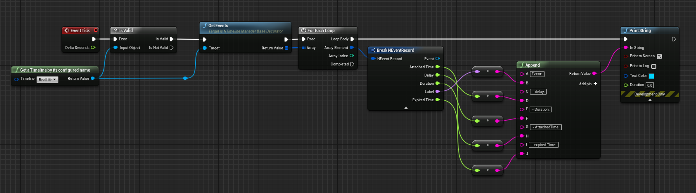
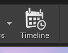
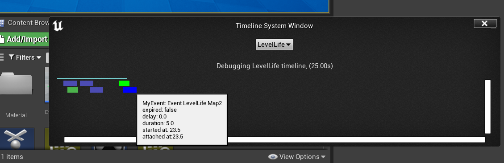

# Getting started - a step by step guide
<a id="markdown-getting-started---a-step-by-step-guide" name="getting-started---a-step-by-step-guide"></a>


<!-- TOC -->

- [1. Installation](#1-installation)
    - [1.1. Clone plugins](#11-clone-plugins)
    - [1.2. Add plugins in your game dependencies](#12-add-plugins-in-your-game-dependencies)
    - [1.3. Use TimelineGameSubSystem and TimelineClient](#13-use-timelinegamesubsystem-and-timelineclient)
- [2. Usages](#2-usages)
    - [2.1. Configure Timelines](#21-configure-timelines)
    - [2.2. Create an Event asset](#22-create-an-event-asset)
    - [2.3. Add Event](#23-add-event)
    - [2.4. Get & display](#24-get--display)
    - [2.5. Debug](#25-debug)

<!-- /TOC -->

## 1. Installation
<a id="markdown-installation" name="installation"></a>


Here you will have a step by step guide, but if you prefer to dive into an already made project, please go to https://github.com/NansPellicari/UE4-Test-NansTimelineSystem

### 1.1. Clone plugins
<a id="markdown-clone-plugins" name="clone-plugins"></a>


First, go to your `Plugins` directory and clone project:

```powershell
cd .\Plugins\
git clone git@github.com:NansPellicari/UE4-TimelineSystem.git NansTimelineSystem
# /!\ renaming destination folder is important, because UE4 doesn't like dash in project name

# or in your root dir if you already use git for your project
git submodule add git@github.com:NansPellicari/UE4-TimelineSystem.git Plugins/NansTimelineSystem
```

You have to clone dependencies too:

```powershell
# still in .\Plugins\ dir
git clone git@github.com:NansPellicari/UE4-TestsHelpers.git NansUE4TestsHelpers
git clone git@github.com:NansPellicari/UE4-CoreHelpers.git NansCoreHelpers

# or in your root dir if you already use git for your project
git submodule add git@github.com:NansPellicari/UE4-TestsHelpers.git Plugins/NansUE4TestsHelpers
git submodule add git@github.com:NansPellicari/UE4-CoreHelpers.git Plugins/NansCoreHelpers

```

### 1.2. Add plugins in your game dependencies
<a id="markdown-add-plugins-in-your-game-dependencies" name="add-plugins-in-your-game-dependencies"></a>


> :warning: I considered you have an Editor Module next to your project. If not, read this:  
> https://ue4community.wiki/legacy/creating-an-editor-module-x64nt5g3  
> BTW, this is required to add Custom Pins and Property Customization.

In your `<MyProject>.uproject` file add these lines:

```json
{
	// other configs here ...
	"Plugins": [
		{
			"Name": "NansTimelineSystem",
			"Enabled": true
		},
		{
			"Name": "NansUE4TestsHelpers",
			"Enabled": true
		},
		{
			"Name": "NansCoreHelpers",
			"Enabled": true
		}
	]
}
```

in your `Source/<MyProject>. Target.cs` :

```csharp
ExtraModuleNames.AddRange(new string[] {
    // Other dependencies here ...
    "NansUE4TestsHelpers",
    "NansCoreHelpers",
    "NansTimelineSystemCore",
    "NansTimelineSystemUE4"
});
```

in your `Source/<MyProject>Editor. Target.cs` :

```csharp
ExtraModuleNames.AddRange(new string[] {
    // Other dependencies here ...
    "NansUE4TestsHelpers",
    "NansCoreHelpers",
    "NansTimelineSystemCore",
    "NansTimelineSystemUE4",
    "NansTimelineSystemEd"
});
```

And be sure to have these in your project public dependencies (in `Source/<MyProject>/<MyProject>. Build.cs` ):

```csharp
PublicDependencyModuleNames.AddRange(new string[] {
    "Core",
    "CoreUObject",
    "NansCoreHelpers",
    "NansTimelineSystemCore",
    "NansTimelineSystemUE4",
});
```

And be sure to have these in your EditorModule public dependencies (in `Source/<MyProject>Editor/<MyProject>Editor. Build.cs` ):

```csharp
PublicDependencyModuleNames.AddRange(new string[] {
    "Core",
    "CoreUObject",
    "Engine",
    "InputCore",
    "Slate",
    "SlateCore",
    "Kismet",
    "NansCoreHelpers",
    "NansTimelineSystemCore",
    "NansTimelineSystemUE4",
    "NansTimelineSystemEd",
});
```

### 1.3. Use TimelineGameSubSystem and TimelineClient
<a id="markdown-use-timelinegamesubsystem-and-timelineclient" name="use-timelinegamesubsystem-and-timelineclient"></a>


[UTimelineGameSubsystem](./Source/NansTimelineSystemUE4/Public/TimelineGameSubsystem.h) is the interface you can use with blueprint or c++:

**> Blueprint**

It is a [GameInstance subsystem](https://docs.unrealengine.com/4.26/en-US/ProgrammingAndScripting/Subsystems/).



**> c++**

```cpp
UWorld* World = GEngine->GetWorldFromContextObject(WorldContextObject, EGetWorldErrorMode::LogAndReturnNull);
if (!World) return nullptr;

UGameInstance* GI = World->GetGameInstance();

UTimelineGameSubsystem* MySubsystem = GI->GetSubsystem<UTimelineGameSubsystem>();

```

## 2. Usages
<a id="markdown-usages" name="usages"></a>


### 2.1. Configure Timelines
<a id="markdown-configure-timelines" name="configure-timelines"></a>


Go to your **project** settings:


then to **Nans Timeline** settings:



then **add** new timeline and configure its **name, tick interval and class** for your needs:



### 2.2. Create an Event asset
<a id="markdown-create-an-event-asset" name="create-an-event-asset"></a>


### 2.3. Add Event
<a id="markdown-add-event" name="add-event"></a>


You should use a timeline manager's function



### 2.4. Get & display
<a id="markdown-get--display" name="get--display"></a>




### 2.5. Debug
<a id="markdown-debug" name="debug"></a>

Thanks to a **button** on the level editor toolbar, you can **open** a new **window** to **visualize events** on any **timeline**.



Has you can see below, every **Event** attached to a timeline is now visible with some **utils info** on **mouse over**.




Enjoy :wink: !
