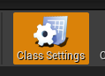
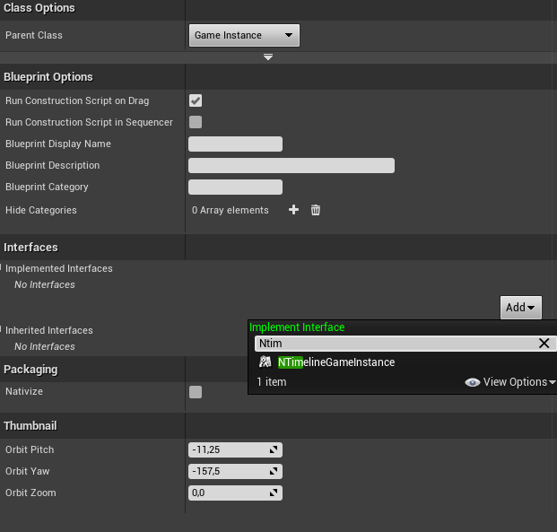
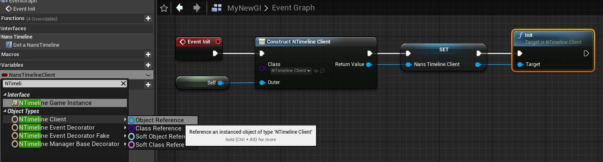
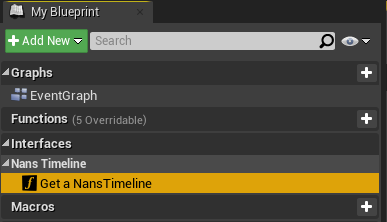
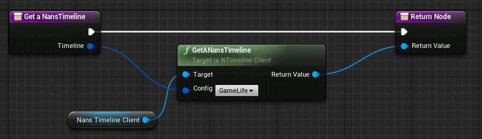
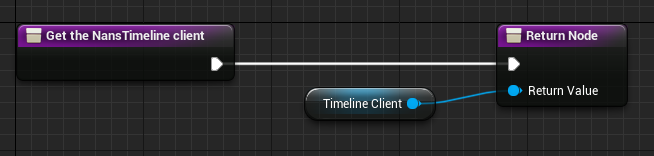

# Step by step guide

<!-- TOC -->

-   [1. Installation](#1-installation)
    -   [1.1. Clone plugins](#11-clone-plugins)
    -   [1.2. Add plugin in your game dependencies](#12-add-plugin-in-your-game-dependencies)
    -   [1.3. Use TimelineGameInstance and TimelineClient](#13-use-timelinegameinstance-and-timelineclient)
-   [2. Usages](#2-usages)
    -   [2.1. Configure Timelines](#21-configure-timelines)
    -   [2.2. Add Event](#22-add-event)
    -   [2.3. Get & display](#23-get--display)

<!-- /TOC -->

<a id="markdown-41-installation" name="41-installation"></a>

<a id="markdown-1-installation" name="1-installation"></a>

## 1. Installation

<a id="markdown-411-clone-plugins" name="411-clone-plugins"></a>

<a id="markdown-11-clone-plugins" name="11-clone-plugins"></a>

### 1.1. Clone plugins

First, go to your `Plugins` directory and clone project:

```powershell
cd .\Plugins\
git clone git@github.com:NansPellicari/UE4-TimelineSystem.git NansTimelineSystem
# /!\ renaming destination folder is important, because UE4 doesn't like dash in project name

# or in your root dir if you already use git for your project
git submodule add git@github.com:NansPellicari/UE4-TimelineSystem.git Plugins/NansTimelineSystem
```

You have to clone dependencies too:

```powershell
# still in .\Plugins\ dir
git clone git@github.com:NansPellicari/UE4-TestsHelpers.git NansUE4TestsHelpers
git clone git@github.com:NansPellicari/UE4-CoreHelpers.git NansCoreHelpers

# or in your root dir if you already use git for your project
git submodule add git@github.com:NansPellicari/UE4-TestsHelpers.git Plugins/NansUE4TestsHelpers
git submodule add git@github.com:NansPellicari/UE4-CoreHelpers.git Plugins/NansCoreHelpers

```

<a id="markdown-412-add-plugin-in-your-game-dependencies" name="412-add-plugin-in-your-game-dependencies"></a>

<a id="markdown-12-add-plugin-in-your-game-dependencies" name="12-add-plugin-in-your-game-dependencies"></a>

### 1.2. Add plugin in your game dependencies

In your `<MyProject>.uproject` file add these lines:

```json
{
	// other configs here ...
	"Plugins": [
		{
			"Name": "NansTimelineSystem",
			"Enabled": true
		},
		{
			"Name": "NansUE4TestsHelpers",
			"Enabled": true
		},
		{
			"Name": "NansCoreHelpers",
			"Enabled": true
		}
	]
}
```

in your `Source/<MyProject>.Target.cs` and `Source/<MyProject>Editor.Target.cs`:

```csharp
ExtraModuleNames.AddRange(new string[] {
    // Other dependencies here ...
    "NansUE4TestsHelpers",
    "NansCoreHelpers",
    "NansTimelineSystemCore",
    "NansTimelineSystemUE4"
});
```

And be sure to have these in your project public dependencies (in `Source/<MyProject>/<MyProject>.Build.cs`):

```csharp
PublicDependencyModuleNames.AddRange(new string[] {
    "Core",
    "CoreUObject",
    "Engine",
    "InputCore",
    "Kismet",
    "NansCoreHelpers",
    "NansTimelineSystemCore",
    "NansTimelineSystemUE4",
    "Slate", "SlateCore"
});
```

<a id="markdown-413-use-timelinegameinstance-and-timelineclient" name="413-use-timelinegameinstance-and-timelineclient"></a>

<a id="markdown-13-use-timelinegameinstance-and-timelineclient" name="13-use-timelinegameinstance-and-timelineclient"></a>

### 1.3. Use TimelineGameInstance and TimelineClient

`UNTimelineGameInstance` is an interface you can use with blueprint or c++:

**> Blueprint**

First create a new Blueprint which inherit from a `UGameInstance` and open blueprint **class settings**:



Add the `NTimelineGameInstance` interface:



Override the `UGameInstance::init()` method + add a new variable of `NTimelineClient` Type:



Override the interface method:







**> c++**

Here an example of a `UGameInstance` class which implements it:

```cpp
// I regroup all in MyGameInstance.h file for simplicity sake.
#pragma once

#include "CoreMinimal.h"
#include "Engine/GameInstance.h"
#include "NansTimelineSystemUE4/Public/Attribute/ConfiguredTimeline.h"
#include "NansTimelineSystemUE4/Public/Manager/TimelineManagerDecorator.h"
#include "NansTimelineSystemUE4/Public/TimelineClient.h"
#include "NansTimelineSystemUE4/Public/TimelineGameInstance.h"

#include "MyGameInstance.generated.h"

UCLASS()
class UE4TIMELINE_API UMyGameInstance : public UGameInstance, public INTimelineGameInstance
{
	GENERATED_BODY()
public:
	UMyGameInstance(){};

	// BEGIN UGameInstance override
	virtual void Init() override
	{
		Super::Init();
		Client = NewObject<UNTimelineClient>(this, FName(TEXT("MyTimelineClient")));
		Client->Init();
	}
	// END UGameInstance override

	// BEGIN INTimelineGameInstance override
	virtual UNTimelineManagerDecorator* GetTimeline_Implementation(FConfiguredTimeline Config) const override
	{
		return Client->GetTimeline(Config);
	}

	virtual UNTimelineClient* GetTimelineClient_Implementation() const override
	{
		return TimelineClient;
	}
	// END INTimelineGameInstance override

protected:
	UPROPERTY()
	UNTimelineClient* Client;
};
```

<a id="markdown-42-usages" name="42-usages"></a>

<a id="markdown-2-usages" name="2-usages"></a>

## 2. Usages

<a id="markdown-421-configure-timelines" name="421-configure-timelines"></a>

<a id="markdown-21-configure-timelines" name="21-configure-timelines"></a>

### 2.1. Configure Timelines

Go to your **project** settings:


then to **Nans Timeline** settings:


then **add** new timeline and configure its **name, tick interval and class** for your needs:


<a id="markdown-422-add-event" name="422-add-event"></a>

<a id="markdown-22-add-event" name="22-add-event"></a>

### 2.2. Add Event

You should use a timeline manager's function


<a id="markdown-423-get--display" name="423-get--display"></a>

<a id="markdown-23-get--display" name="23-get--display"></a>

### 2.3. Get & display


Enjoy :wink: !
