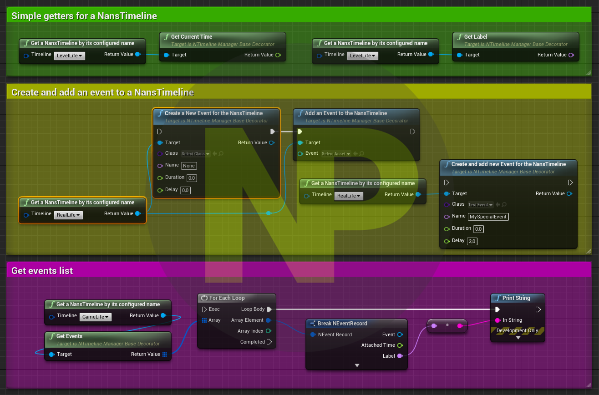

# Nans Timeline system

This plugins allows to keep tracks of time for different timeline paradigm(1), attached events(2) to them and managed serialization for Save and Load game.

> 1 [Real life](#331---real-life) time, [Game life](#332---game-life) and [Level life](#333---level-life)  
> 2 Light blueprint asset carrying data and/or simple functionnalities you design

> Note:  
> I've hesitated at first to use the word **"Timeline"** which is already used in the UE4 paradigm for animation (see [this](https://docs.unrealengine.com/en-US/Engine/Blueprints/UserGuide/Timelines/index.html)).  
> The thing is, it's the most accurate word for the feature this plugin provides, 
> so I still decided to use it but for BP I prefixed with **Nans** (= **NansTimeline**) everywhere to avoid confusion.

|                                                                                                                                                                                                              |
| :---------------------------------------------------------------------------------------------------------------------------------------------------------------------------------------------------------------------------------------------------------------------------------------------------------------------------------------------------------------------------------------------: |
| I've decided to make most of the code I developed for my games free to use and open source.  I am a true believer in the mindset that sharing and collaborating makes the world a better place.  The thing is: I'm full time dedicated to my project and these open source plugins, for coding I need a looooot of coffee, so please, help me to get my drug :stuck_out_tongue_closed_eyes: !! |

<!-- TOC -->

- [1. Requirements](#1-requirements)
    - [1.1. UE4 plugins](#11-ue4-plugins)
- [2. Usages](#2-usages)
- [3. Definitions](#3-definitions)
    - [3.1. Timeline](#31-timeline)
    - [3.2. Timeline manager](#32-timeline-manager)
    - [3.3. Timeline manager types](#33-timeline-manager-types)
        - [3.3.1. - Real Life](#331---real-life)
        - [3.3.2. - Game Life](#332---game-life)
        - [3.3.3. - Level Life](#333---level-life)
        - [3.3.4. - And ...](#334---and-)
    - [3.4. Event](#34-event)
- [4. Getting started - a step by step guide](#4-getting-started---a-step-by-step-guide)
- [5. Contributing and Supporting](#5-contributing-and-supporting)

<!-- /TOC -->

**>> For developers:**

*   [Developers docs](./Docs/Developers.md)

## 1. Requirements

### 1.1. UE4 plugins

*   [NansUE4TestsHelpers](https://github.com/NansPellicari/UE4-TestsHelpers) (free UE4 plugins)
*   [NansCoreHelpers](https://github.com/NansPellicari/UE4-CoreHelpers) (free UE4 plugins)

## 2. Usages

I use this for differents purposes.  
First I created this to manage a **bonus/malus** system cause I needed to centralized their life duration.  
Then I realized that it can be very helpfull for **different purposes** in my game as creating **promotionnal content**, **bonus/malus**, **temporary skills**, **xp earning factors**, ... with a limited time and having **precise stats** for **player activities**.

## 3. Definitions

### 3.1. Timeline

A timeline is a simple **queue of events** which is dedicated to store (to keep traces for stats) and notify them (depending on their parameters and timeline paradigm) on their lifetime events: start & time increase.  
As a client, you should never have to use it.

### 3.2. Timeline manager

Is working as a remote control for **Timeline**, it controls time state (Play, Pause) and stream (tick interval, slow motion, ...).  
As a client, it is your main interface.

### 3.3. Timeline manager types

#### 3.3.1. - Real Life

The intent of the **Real Life** timeline is to track times **since** the **first start of the game**.  
It is **not affected** by **time alterations** such as **play/pause** and **slow motion**.  
After the game stops, it shoulds **replay** all the **missing time** on game reloading to **update** attached **Events states**.  
As real life is, its state is always **Play**.  
Be careful when you attached events, it could increase memory if they have undeterminate life time.

#### 3.3.2. - Game Life

It keeps track of player game session. It follows the same stream, **Play/Pause**, **Stop**, **slow motion**, ...  
After the game stops, it shoulds restart at the exact same time as the last session.  
Be careful too when you attached event here.

#### 3.3.3. - Level Life

The same as [Game Life](#2--game-life) but it is reinitialized when level changes.  
You can be less worried on attaching event here, but be aware that all events are definitively removed on reinitialization (level changes).

#### 3.3.4. - And ...

You can easily create your own timeline manager. See [Developers docs](./Docs/Developers.md).

### 3.4. Event

It is intended to be the most extensible as possible.  
So in its actual state, it is just a base UObject which embeds the necessary data to managed its lifetime.  
You can specialized it with a dedicated **Blueprint asset** or in **c++ classes** (creating a [Decorator](https://refactoring.guru/design-patterns/decorator) of the [UNEventBase](./Source/NansTimelineSystemUE4/Public/Event/EventBase.h)) to do what your want.  
To get some examples:

*   I create a **scheduled event** to **trigger a message** to motivate the player when it cumulates an amount of succeeded actions during a determinate range of time.
*   In combination with my [Factors Factory System](https://github.com/NansPellicari/UE4-FactorsFactory) and **Interaction System**, I used them to create a temporary **Bonus/Malus factor** after an Actor interaction.
*   ... Sky's the limit!

## 4. Getting started - a step by step guide

To maintain a short doc here, please read this page [here](./Docs/StepByStep.md)

## 5. Contributing and Supporting

I've decided to make most of the code I developed for my games free to use and open source.  
I am a true believer in the mindset that sharing and collaborating makes the world a better place.  
I'll be very glad if you decided to help me to follow my dream.

| How?                                                                                                                                                                               |                                                                                         With                                                                                         |
| :--------------------------------------------------------------------------------------------------------------------------------------------------------------------------------- | :----------------------------------------------------------------------------------------------------------------------------------------------------------------------------------: |
| **Donating**  Because I'm an independent developer/creator and for now I don't have  any income, I need money to support my daily needs (coffeeeeee).                        |  |
| **Contributing**  You are very welcome if you want to contribute. I explain [here](./CONTRIBUTING.md) in details what  is the most comfortable way to me you can contribute. |                                                                         [CONTRIBUTING.md](./CONTRIBUTING.md)                                                                         |
