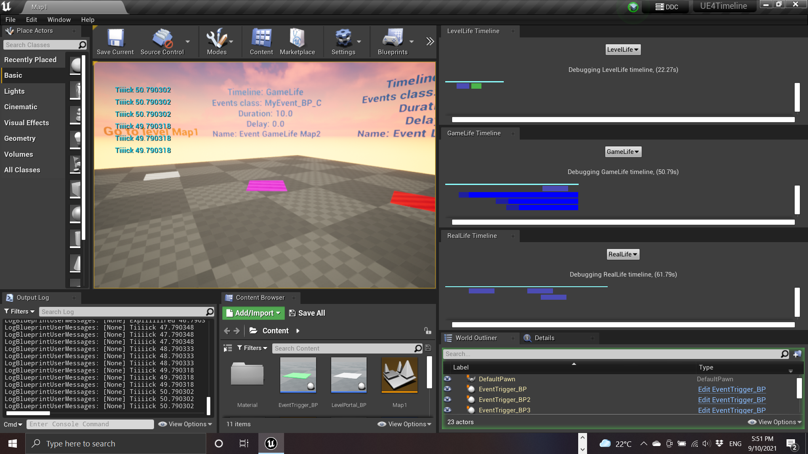

# Nans Timeline system

This plugin allows you to keep track of time according to different timeline paradigms(1), attach events(2) to them, and manage serialization for saving and loading games.

> 1 [Real life](#331---real-life) time, [Game life](#332---game-life) and [Level life](#333---level-life)
> 2 Light blueprint asset carrying data and/or simple features you design

> Note:
> I've hesitated at first whether to use the word **"Timeline"** or not because it is already used in the UE4 paradigm for animation (see [this](https://docs.unrealengine.com/en-US/Engine/Blueprints/UserGuide/Timelines/index.html)).
> The thing is, it's the most accurate word for the feature this plugin provides that I could think of,
> so I ended up deciding to use it after all, but for BP I have prefixed it with **Nans** (= **NansTimeline**) everywhere to avoid confusion.

|                  |
| :-------------------------------------------------------------------------------------------------------------------------------------------------------------------------------------------------: |
|                                                I've decided to make most of the code I have developed for my games free to use and open source.                                                  |
|                                             **I am a true believer in the mindset that sharing and collaborating make the world a better place**.                                               |
| But the thing is: I'm dedicated full time to my projects and these open-source plugins, and, for coding, I need a looooot of coffee, so please, help me get my drug :stuck_out_tongue_closed_eyes: !! |

<!-- TOC -->
## Table of Contents

- [1. Requirements](#1-requirements)
  - [1.1. UE4 plugins](#11-ue4-plugins)
- [2. Use Cases](#2-use-cases)
- [3. Definitions](#3-definitions)
  - [3.1. Timeline](#31-timeline)
  - [3.2. Timeline Manager](#32-timeline-manager)
  - [3.3. Timeline Manager types](#33-timeline-manager-types)
    - [3.3.1. - Real Life](#331---real-life)
    - [3.3.2. - Game Life](#332---game-life)
    - [3.3.3. - Level Life](#333---level-life)
    - [3.3.4. - And ...](#334---and-)
  - [3.4. Event](#34-event)
- [4. Getting Started - a step by step guide](#4-getting-started---a-step-by-step-guide)
- [5. Contributing and Supporting the Project](#5-contributing-and-supporting-the-project)
- [6. License](#6-license)

<!-- /TOC -->

**>> For developers:**

*   [Developers docs](./Docs/Developers.md)

## 1. Requirements

### 1.1. UE4 plugins

*   [NansUE4TestsHelpers](https://github.com/NansPellicari/UE4-TestsHelpers) (free UE4 plugins)
*   [NansCoreHelpers](https://github.com/NansPellicari/UE4-CoreHelpers) (free UE4 plugins)

## 2. Use Cases

I use this plugin for different purposes.

I Initially created the plugin to manage a **bonus/malus** system because I needed to keep track of their lifetime durations in a unified fashion.

But soon I realized that this pattern could be very helpful for **many other purposes** in my game too, such as creating **promotional content**, **bonus/malus**, **temporary skills**, **xp earning factors**, ... all of this very quickly and all the while providing you with **precise stats** on **player activities** without writing additional code.

## 3. Definitions

### 3.1. Timeline

A **Timeline** is a simple **queue of events** that is dedicated to storing (maintaining a kind of log used for stats) and triggering them (depending on their parameters and on the timeline paradigm in use) on their lifetime events: start & time increase.
As a plugin user, you should never need to use this class.

### 3.2. Timeline Manager

The **Timeline Manager** works as a remote controller for a **Timeline**, it controls time state (Play, Pause) and stream parameters (Tick Interval, Slow Motion, ...).

As a plugin user, **this** will be your main interface.

### 3.3. Timeline Manager types

#### 3.3.1. - Real Life

The **Real Life** timeline intends to track time **since** the **very first start of the game**.

It is **not affected** by **time alterations** such as **Play/Pause** or **Slow Motion**.

After the game has stopped, once it starts again it should **replay** all the **missing time** to **update** the attached **Event States** (that is, replay all the times that passed in the real world while the player was not playing).

Like real life, the state in the **Real Life** timeline is always **Play**.

Be careful when you attach events to this timeline though, as too many events could increase memory usage if the events have an undetermined lifetime.

#### 3.3.2. - Game Life

This type of lifetime keeps track of a player's game session.
It follows the same stream as the **Real Life** timeline: **Play/Pause**, **Stop**, **Slow Motion**, ...

But contrary to the **Real Life** timeline, after the game has been stopped, once it starts again, it should resume exactly where the previous session had ended.

Be mindful of memory usage when you attach an event there too.

#### 3.3.3. - Level Life

The same as [**Game Life**](#2--game-life), but it is re-initialized each time the level changes.

You can be less worried about attaching events to this timeline, but be aware that all events are destroyed upon re-initialization of the timeline (level change).

#### 3.3.4. - And ...

You can easily create your custom **Timeline Manager**. 
See [Developers Docs](./Docs/Developers.md).

### 3.4. Event

The **Event** class is intended to be as extensible as possible.
So in its current state, it is just a base **UObject** that embeds the necessary data to manage its lifetime.

You can specialize it either with a dedicated **Blueprint Asset** or using **C++ classes** (by creating a [Decorator](https://refactoring.guru/design-patterns/decorator) for the [UNEventBase](./Source/NansTimelineSystemUE4/Public/Event/EventBase.h)) to make it do what you want.

To give you some examples:

* I created a **Scheduled Event** to **trigger a message** to motivate the player once they have successfully accomplished a specific amount of actions during a determined period.
* Combining this event with my [Factors Factory System](https://github.com/NansPellicari/UE4-FactorsFactory) and **Interaction System**, I created a temporary **Bonus/Malus factor** after an **Actor** interaction.
* ... Sky's the limit!

## 4. Getting Started - a step by step guide

To keep this README shorter, I wrote a separate [step-by-step guide](./Docs/StepByStep.md), should you need further information.

## 5. Contributing and Supporting the Project

I've decided to make most of the code I have developed for my games free to use and open source.

I am a true believer in the mindset that **sharing and collaborating make the world a better place**.

I would of course be very glad if you would decide to help me follow my dream.

| How?                                                                                                                                                                                                   |                                                                                         With                                                                                         |
| :----------------------------------------------------------------------------------------------------------------------------------------------------------------------------------------------------- | :----------------------------------------------------------------------------------------------------------------------------------------------------------------------------------: |
| **Donating**  Because I'm an independent developer/creator and for now I don't have  any income, I need money to support my daily needs (coffeeeeee).                                            |  |
| **Contributing**  You are most welcome to contribute if you want to! I explain in more detail which is the preferred way to contribute to this project in a [separate document](./CONTRIBUTING.md) |                                                                         [CONTRIBUTING.md](./CONTRIBUTING.md)                                                                         |

## 6. License

* By using this software you agree to accept the UE4 license entirely
* You are free to share, modify and use the plugin as you wish (even commercially)
